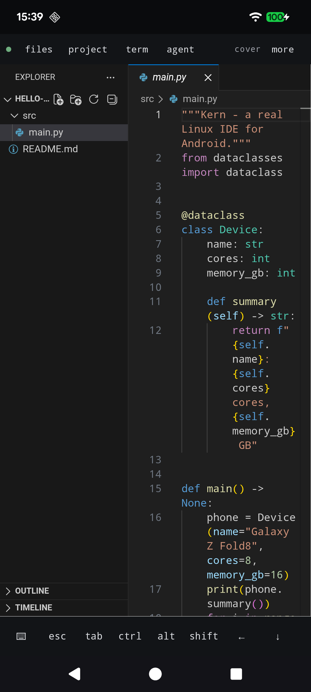
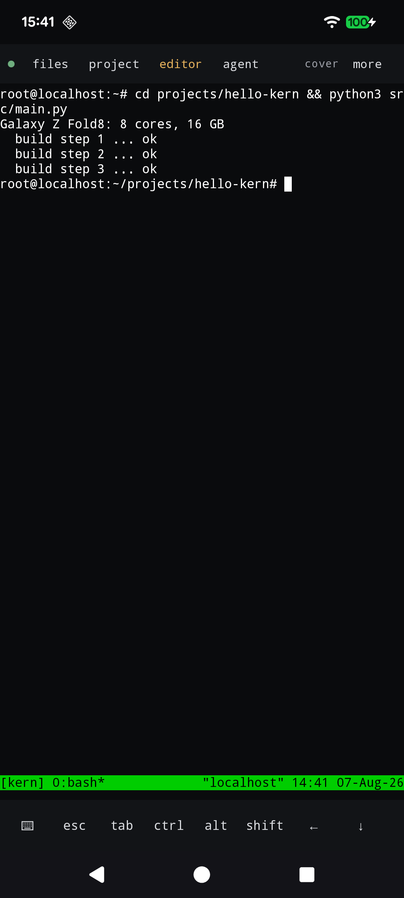
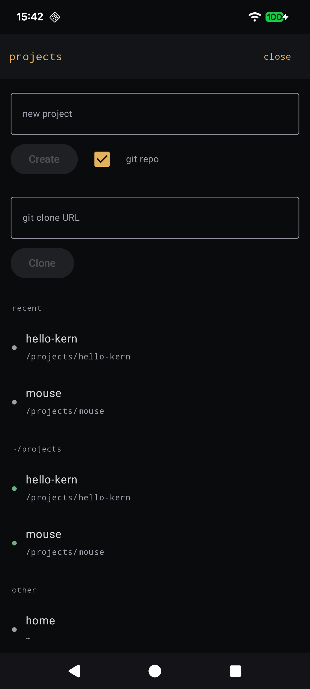
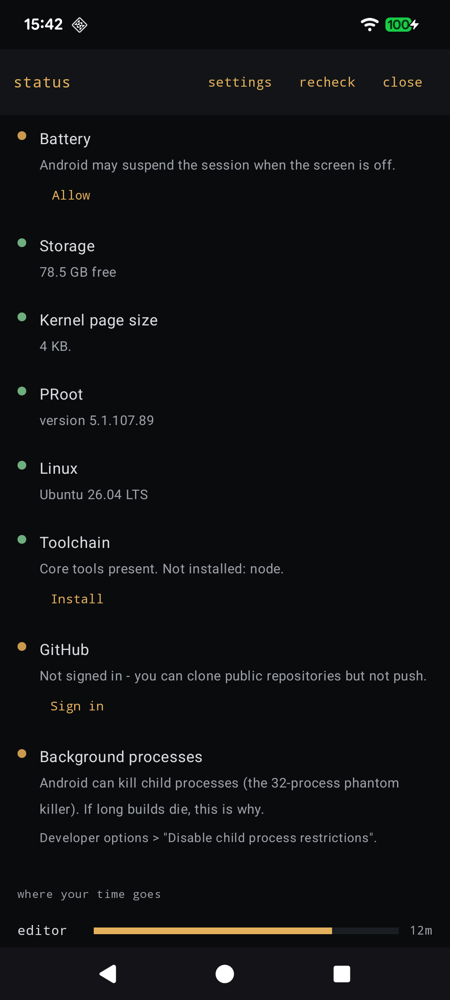

# Kern

**A real Linux IDE for Android.** Not a remote client, not a toy editor — a complete
Ubuntu development environment and the VS Code workbench, running entirely on the phone,
in one app with nothing else to install.

```
Ubuntu 26.04 LTS · code-server 4.131 · git · tmux · python3 · ripgrep
```

Kern installs a real Ubuntu filesystem inside its own sandbox and runs it through PRoot.
`apt install` works. Compilers, language servers and CLI agents are the ordinary glibc
builds from the Ubuntu archive, not special mobile ports. No root, no Termux, no server
in a datacentre.

**Status: working, pre-release.** Setup takes about two minutes to a usable editor. It
has been verified end to end on device — the numbers in this README are measured, not
estimated.

<p align="center">
  
  
  
  
</p>

<p align="center"><sub>Editor · terminal · projects · health — all on the phone, nothing remote.</sub></p>

---

## What it does

|  |  |
|---|---|
| **Editor** | The real VS Code workbench (code-server) with its own chrome hidden. The web layer renders only the editor; every surface around it is native Compose. |
| **Terminal** | A genuine PTY into the guest, drawn by a native terminal emulator — no xterm.js, no WebView in the input path. `tmux` keeps sessions alive across detach. |
| **Linux** | Ubuntu 26.04 LTS with working `apt`, fake root, and the whole Ubuntu archive available. |
| **Projects** | Create a project, `git clone` one, or open any folder — read natively from the guest filesystem. |
| **GitHub** | One-tap sign-in via device flow. Registers gh as git's credential helper, so `git push` then works everywhere: the editor's Git panel, the terminal, any agent. |
| **Adaptive** | Lays out for the screen it is on — phone, tablet, unfolded, tabletop (editor above the crease, terminal below) and desktop mode. |
| **Input** | A coding key row with sticky modifiers, explicit keyboard control, and hardware-keyboard chords. |
| **Health** | A status screen that says what is wrong with the environment, with a button that fixes it rather than a command to copy. |

## How it works

The interesting problem is that Android forbids executing code from app-writable storage.
Kern sidesteps that without root and without a hack:

1. **PRoot lives in `nativeLibraryDir`**, which is read-only and therefore exempt from
   W^X. Executing from there is Google's own documented alternative.
2. **Guest binaries are never handed to the kernel.** `PROOT_LOADER` points at a small
   static stub that `mmap`s the guest ELF `PROT_EXEC` and jumps to its entry point. That
   needs only SELinux `file execute` — the permission apps retain — never
   `execute_no_trans`, which was removed at targetSdk ≥ 29.
3. **PRoot fakes uid 0**, which is what makes `apt` and `dpkg` work at all.

The consequence is that this runs at **targetSdk 36** on a stock, unrooted device.

The full mechanism, including the flags that are load-bearing and the ways they fail when
they are wrong, is in [docs/11-embedded-linux.md](docs/11-embedded-linux.md).

## Requirements

- Android 8.0+, **arm64**
- ~400 MB of download and ~1.2 GB of storage for the Linux environment
- Wi-Fi for first run

Developed against a Galaxy Z Fold8 and a Pixel. The adaptive layouts need a foldable to
exercise properly; everything else is device-agnostic.

## Building

```
./gradlew assembleDebug      # → app/build/outputs/apk/debug/app-debug.apk
```

Requires JDK 17 and the Android SDK with NDK (there is a small JNI PTY implementation).
See [docs/09-building.md](docs/09-building.md).

## First run

Press **Set up Linux** once. Setup runs in two halves:

| Phase | What happens | Measured |
|---|---|---|
| 1 | Ubuntu base image, unpack, configure apt, install code-server | **~133s to a usable editor** |
| 2 | git, gh, tmux, curl, ripgrep, python3 — installed *behind* the running IDE | ~184s to complete |

You are in the editor while the second half runs, with a strip reporting what is still
installing. Live output is shown throughout — no unexplained multi-minute pauses.

## Documentation

Start at **[docs/README.md](docs/README.md)**, which indexes everything and says which
documents describe the system as it is versus how it got here.

## Licence

GPLv3. Kern vendors Termux's terminal emulator and view, which are GPLv3, so the whole
work is GPLv3. Attribution and third-party components are listed in
[NOTICE.md](NOTICE.md).

## Acknowledgements

- **[Termux](https://github.com/termux/termux-app)** — the terminal emulator and view,
  and the maintained Android-patched PRoot build this depends on.
- **[code-server](https://github.com/coder/code-server)** — VS Code as a server.
- **[Ubuntu](https://ubuntu.com/)** — the base image and the archive behind `apt`.
- **[PRoot](https://proot-me.github.io/)** — userspace `chroot` via `ptrace`.
